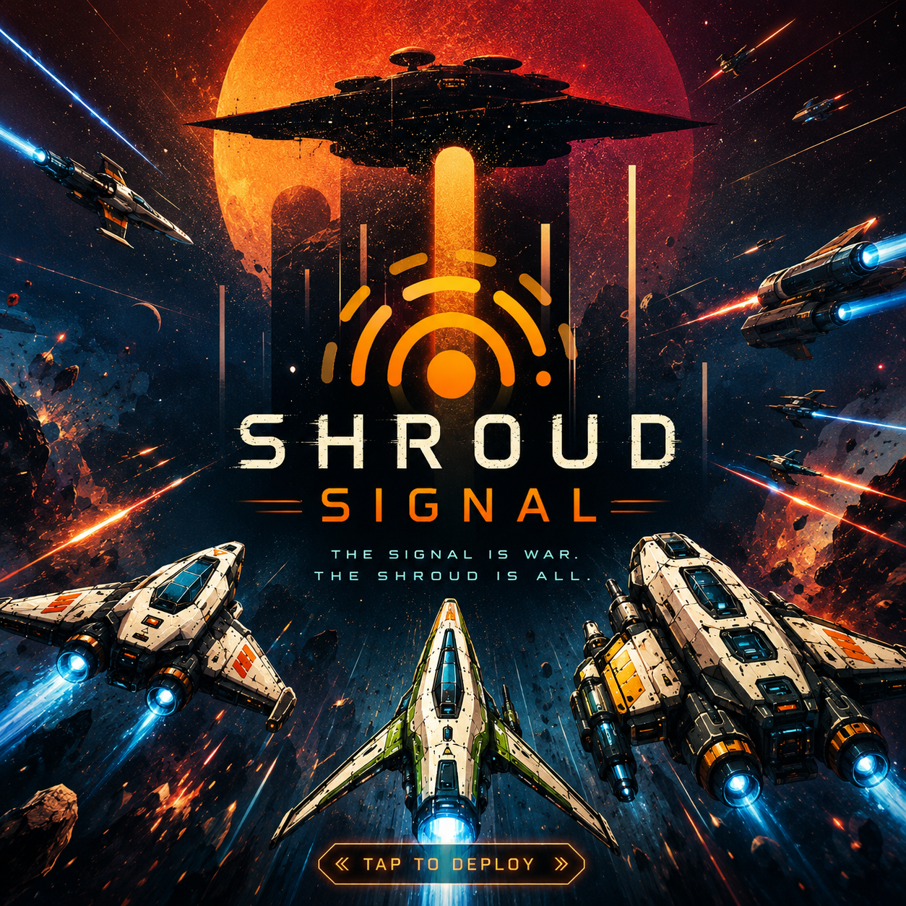

  

## Shroud Signal

A shared sector of space, live inside your subreddit. Built for the [Phaser × Reddit hackathon](https://phaser.io/news/2026/06/reddit-and-phaser-launch-a-40-000-game-dev-hackathon) on [Devvit](https://developers.reddit.com/). A spin-off of [Mentaverse](https://mentagame.com), another game I've been developing, reusing its ship art and lore.

No login flow, no accounts, no external database: player identity, position, combat, progression, and scoring all live on Devvit's own Redis, realtime pub/sub, and scheduler primitives, inside the Reddit posts that spawned them.

Every control works the same on desktop and mobile: `Space`/fire button for your primary weapon, `E`/2nd-weapon button for your secondary, `Q` (or `R` in battle arenas)/ability button for your ship line's active ability, and a virtual joystick and on-screen action buttons that are always visible (not just on touch devices, since they also route around Reddit's own page occasionally swallowing keyboard input).

## Game modes

**Free-Play Sectors.** Post **"Chart a New Sector"** from a subreddit's menu and anyone who opens it picks a ship — one of five lines pulled from Mentaverse's starter fleet — then flies it in real time alongside everyone else currently in that post. Fire on other pilots, climb the subreddit-wide leaderboard, and listen for the ambient "galaxy pulse," a scheduled rumor about the Shroud broadcast to every active sector every five minutes. You can revisit the sector anytime to pick a different ship — it's not locked in.

Every newly-charted sector also gets a random theme. Right now that's always **Starbase Defense**: a pirate wanted level that escalates in waves. Raiders fly in from the sector's edges, more of them each wave (3 to 8 waves total, picked at random), and either hunt down nearby pilots or make straight for the sector's starbase if no one's close. The final wave is always a pirate capital ship — a boss with a much bigger hull pool that hits twice as hard. Defend the starbase until its hull runs out and the mission is lost, or clear every wave (boss included) and it's secured. A MISSION HUD tracks wave progress and starbase hull for everyone in the sector, and pirate kills grant the same pilot rewards as PvP kills. More sector themes (mining raids interrupted by pirates, escort duty for a repairing frigate, VIP/cargo pickups, salvage races against pirate looters) are planned.

**Battle Arenas (Last One Standing).** A mod can run **"Challenge a Subreddit"** to pit their community against another one: set a player cap per team and a warm-up window, the other subreddit's moderators accept or counter, and once accepted both subreddits get a synced arena post for a best-of-3 series. During warm-up, joining players pick an individual ship or commit their whole team to a squad preset. Eliminated pilots sit out the rest of that round; if a round times out with survivors on both sides it's a tie, and a series tied on round wins after 3 rounds is broken by how long each team's fleet survived (credited per round, not just a flat clock). Both creating and responding to a challenge require moderator permissions on the acting subreddit.

**Scrimmages.** A mod can also run **"Start a Scrimmage"** for a same-subreddit practice battle — no challenge/counter handshake, just pick 5v5 or 10v10, auto-balanced or manual team pick, and an open or whitelist-gated join policy, then share the arena post with your community. It plays through the exact same round engine as a cross-subreddit battle arena — same eliminations, same survival-credit tiebreaker, same squad rules — just local.

In battle arenas and scrimmages alike, the 5 ship lines are a real choice, not cosmetic: each has its own speed/hull/damage profile and a unique ability (Fighter overcharges its weapon, Miner drops proximity mines, Transport shields itself, Pathfinder pings the enemy fleet and shares the reveal with its whole team, Tender heals its nearest ally), and a team can't stack more than 2 of the same line by default, so squad composition is an actual decision. The challenger (or scrimmage host) can set the squad rule to "custom," lifting the 2-per-line cap for the whole match, and a team can also commit to one of 4 curated squad presets (Balanced Wing, Aggro Rush, Turtle Wall, Recon Strike) instead of picking ships individually.

Free-play sectors adopt this same per-line weapon and ability kit — it's not just laser and torpedo for everyone anymore. Fighter still carries laser + torpedo (its second weapon is a slower, harder-hitting missile in arenas instead), Miner runs an autocannon, Transport a burst cannon, Pathfinder plasma, and Tender a flak battery that can shoot down an incoming torpedo instead of firing its shotgun spread. Sector pirates use this same weapon roster too, so a firefight looks and feels consistent whether the enemy is another pilot or a raider.

## Persistent pilot profile

Your ship line is chosen once per Reddit account and locked in — no respeccing, but it follows you into every sector and every battle arena. Press `P` in a free-play sector to see your pilot card: level and XP (from hits and kills, in both PvP and against pirates), lifetime credits, and current ship tier. Dying to another pilot or a pirate costs a small percentage of your credits, scaled so it never crushes a low balance.

## Finding "Chart a New Sector" / "Challenge a Subreddit" / "Start a Scrimmage"

These are subreddit-level Devvit menu actions, not Mod Tools entries — a common point of confusion. To find them:

1. Go to the subreddit itself (not `mod.reddit.com` or the Mod Tools dashboard).
2. Look for the **"•••" (more actions)** icon on the subreddit page itself, near "Create Post"/community options.
3. All three actions show up in that dropdown.

You need to be a moderator of that subreddit, logged in as that account, for any of them to appear. Desktop new-Reddit has the most reliable support for custom Devvit menu actions; Reddit's official mobile app/mobile web can be spottier.

## About this project

Shroud Signal is a spin-off of [Mentaverse](https://mentagame.com), another game I've been developing, also built in Phaser. Same developer, same universe, just me borrowing my own assets for a hackathon. Nothing here is lifted from anyone else's work.

I just really like Phaser and wanted to build something fun for Reddit's hackathon with it, to show how versatile and cool the engine actually is.

I'm IceMasterT ([GitHub](https://github.com/icemastert), u/Capital_Vegetable_80), and I've got a few more Phaser games in the works:

- A 2.5D beat 'em up starring princesses who are done waiting around to be rescued. Sick of playing damsel in distress, they band together and start rescuing other princesses instead, and when their own kingdom finally gets captured, they flip the script completely: this time it's the princesses saving the prince, and the kingdom, themselves.
- **Viral Vendetta**, a PvP Pokemon/Final Fantasy style battler currently in testing. You fight toxic internet personalities in ridiculous turn based duels, and winning means either torching their reputation or crushing their ego into dust. Petty, cathartic, and genuinely funny.

## How it's built

- **`@devvit/redis`**: per-sector player state, per-match rosters, pirate NPC/mission state, and persistent pilot profiles all live as Redis hashes/counters. Hull, score, kills, credits, XP, and every other value two concurrent requests could race on use dedicated atomic operations (`hIncrBy`, `hSetNX`-style claim keys) instead of read-modify-write, so a burst of simultaneous hits, kills, ability activations, or wave-advances can't double-count or desync. Completed matches, resolved challenges, and finished missions carry a TTL so old game state ages out of Redis automatically instead of accumulating forever.
- **`@devvit/realtime`**: server-to-client pub/sub broadcasting join/move/leave/score/shot/hit/respawn/ability/heal/mine/pulse/mission-state events (and more) to every pilot in a sector or arena. Clients also react to the channel disconnecting and reconnecting rather than silently going stale.
- **`@devvit/scheduler`**: a cron task that pulses ambient flavor text to every sector active in the last 24 hours.
- **Phaser 4**: flight physics, a starfield, live remote-ship interpolation, HUDs (score, leaderboard, pilot profile, mission status), laser/missile/mine/torpedo combat, and a shared virtual-joystick/touch-button input module so desktop and mobile run the same control scheme, all rendered client-side.

Combat, movement, cooldowns, and every scoring/reward path are server-authoritative: the server fires from a shooter's own last-known tracked position rather than trusting client-supplied coordinates, enforces every cooldown and rate limit itself via atomic Redis claims rather than relying on the client, and validates every request body at the HTTP boundary rather than trusting its shape. Laser and missile hits both render instantly on the shooter's own screen instead of waiting on the realtime broadcast to round-trip back — that round-trip isn't reliable enough on real mobile networks to gate what you see when you pull the trigger.

`scripts/simulate-battles.ts` is a standalone tool that runs full 10v10 best-of-3 matches through the exact same combat math the server uses, to check win rates per ship line and catch state bugs (crashes, negative hull, stuck rounds) before they ship — it's how the current ship balance was tuned.

## Commands

- `npm run playtest [r/sub]`: watches changes, builds, uploads, and installs on Reddit. Accepts an optional subreddit.
- `npm run build`: builds client and server, including esbuild metafiles.
- `npm run clean`: removes build outputs.
- `npm run test`: runs all tests (type-check, lint, unit tests, build).
- `npm run format`: fixes lints and formatting.
- `npm run lint`: checks lints and formatting.
- `npm run publish`: cleans, builds, uploads, and files a new app review request.
